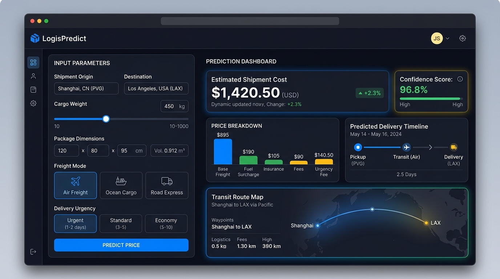

# 📦 LogisPredict — Smart Freight & Shipment Price Predictor



An end-to-end Machine Learning web application designed to forecast freight and logistics shipping costs with dynamic route mapping, real-time cost breakdown analytics, and high-precision regression models.

---

## 🌟 Key Features

* **Real-time Price Estimation:** Calculates shipping costs instantly based on distance, cargo weight, dimensions, mode, and urgency.
* **Price Breakdown Analytics:** Interactive Plotly visual charts breaking down base freight, fuel surcharges, insurance, and fees.
* **Live Transit Route Map:** Dynamic geographic arc visualization displaying the origin-to-destination flight/shipping route.
* **Confidence & Reliability Metrics:** Provides model confidence scores based on trained historical shipment datasets.
* **Modern Dark UI:** Responsive and sleek dashboard crafted with Streamlit and custom styling.

---

## 🛠️ Tech Stack

* **Language:** Python
* **Web Framework:** Streamlit
* **Data & Machine Learning:** Scikit-Learn, XGBoost, CatBoost, Pandas, NumPy
* **Data Visualization:** Plotly, Matplotlib, Seaborn
* **Database & Storage:** MongoDB Atlas
* **Serialization & Config:** Pickle, Dill, PyYAML
* **Containerization:** Docker

---

## 🚀 Quick Start (Local Setup)

### 1. Clone the repository
```bash
git clone https://github.com/tamimystic/Shipment-Price-Prediction-ML-Project.git
cd Shipment-Price-Prediction-ML-Project
```

### 2. Create and activate a virtual environment
```bash
conda create -n shipment python=3.10 -y
conda activate shipment
```

### 3. Install dependencies
```bash
pip install -r requirements.txt
```

### 4. Run the Streamlit Application
```bash
streamlit run app.py
```

---

## ☁️ Deployment

### Streamlit Community Cloud (Recommended)
1. Fork or push this repository to your GitHub.
2. Go to [share.streamlit.io](https://share.streamlit.io) and click **"New app"**.
3. Select this repository, branch `main`, and main file path `app.py`.
4. Click **"Deploy"**!

---

## 👤 Author
- **MD. Tamim Hossain** — Computer Science & Engineering